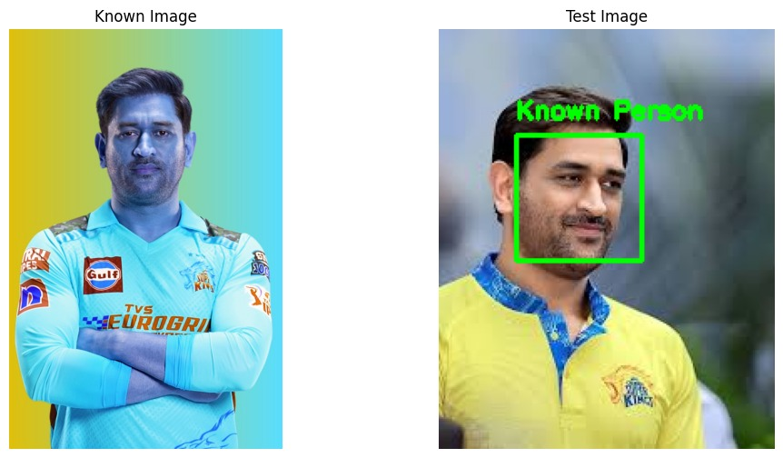
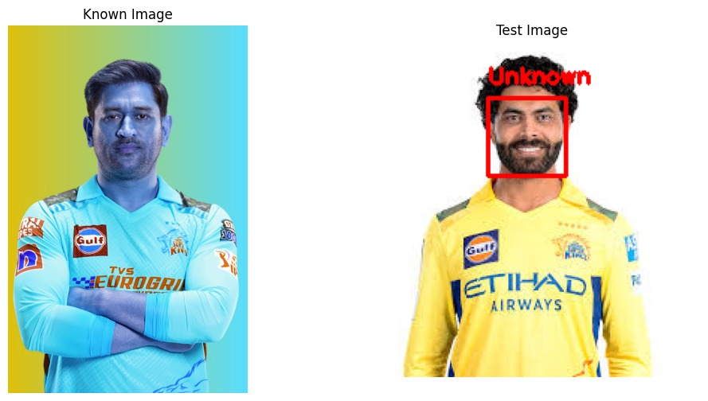

# Face Recognition (Matching) 🔍

This project performs face recognition using Python and the `face_recognition` library. It compares a known image (source) with test images to detect and label matched faces.

## 📁 Project Structure

        Face_recognition (Matching)/
        
        │
        ├── Images/
        │ ├── source_image.jpg # Known person image
        │ ├── test-1.jpg # Test image 1
        │ └── test-2.jpg # Test image 2
        |
        └──Face_recognition_matcher.ipynb

## ✅ Features

- Detects and encodes faces in images.
- Compares test image faces with a known source image.
- Labels matched faces as `Known Person` and unmatched as `Unknown`.
- Visualizes both known and test images using `matplotlib`.

## ⚙️ Setup Instructions

### 1. Clone the Repository

    git clone https://github.com/anjankumar234/Face_recognition_matcher.git
    cd Face_recognition_matcher

## Install Required Packages
    pip install face_recognition opencv-python matplotlib

Note: dlib is required and is installed as a dependency of face_recognition.
## Add Images
Place your images in the Images/ folder and update paths in the script if necessary.

## Output
This will display two subplots:

+ The known image

+ The test image with face boxes and labels

+ Example Output
+ Green box: Known face detected ✅

+ Red box: Unknown face ❌

## Sample Images

  
  

## 🙋‍♂️ Author
Anjan Kumar K

GitHub: anjankumar234
